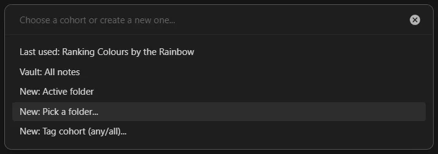
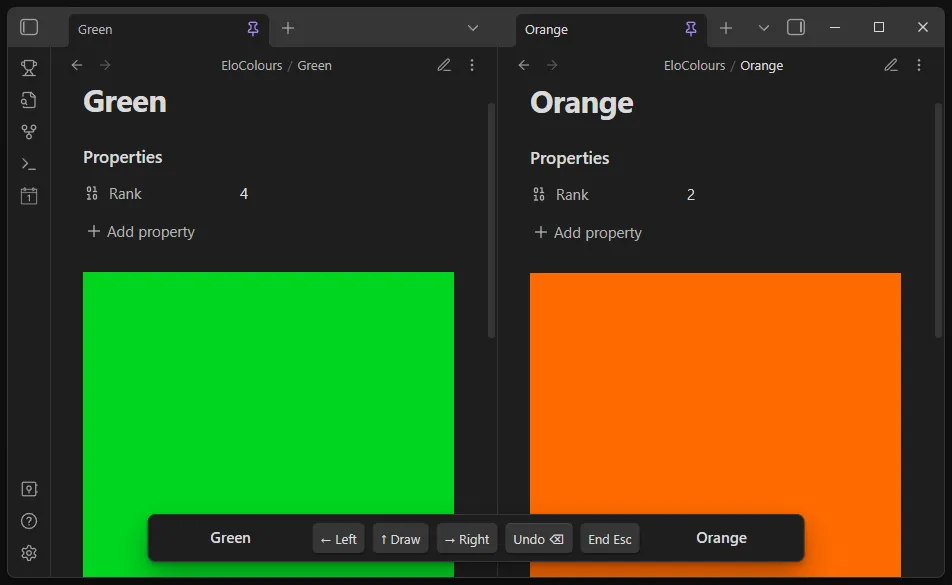
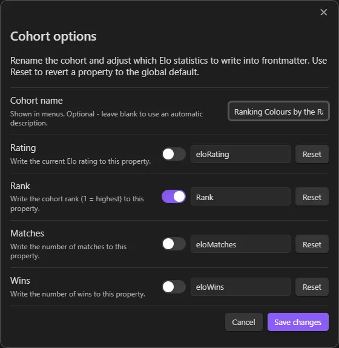
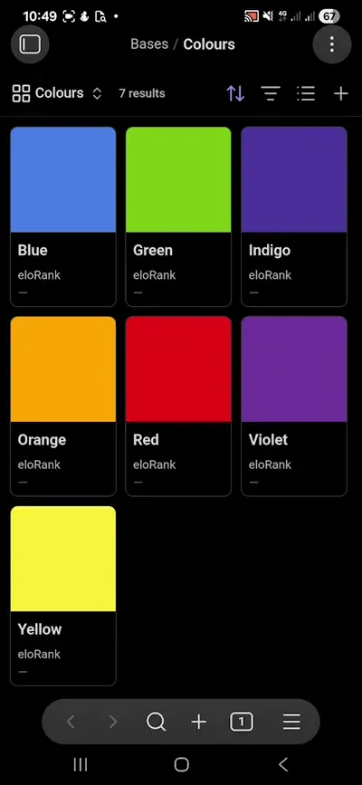

# Pairwise Elo ranking for your notes

Easily sort notes by any subjective criteria using the **Elo rating system**.

It's basically "which one wins?" instead of trying to assign absolute scores. Rather than asking "how does this note compare to every other note?", you only answer: "which of these two do I prefer?"

### Learn more about yourself and your preferences by seeing how you rank your own notes. Try these ideas in seconds:

- Which book or movie is really your favourite? Rank your **Books#Read** or **Movies#Watched** Base views.
- Which project ideas are most worth pursuing? Rank your **#idea** tag.
- Which purchase is the highest priority for you right now? Rank your **#to-buy** tag.
- Which recipes should become your go-to staples? Rank your **Recipes** Base.
- Which museums, hikes, or travel destinations should you explore next? Rank your **Places** Base.
- Which research papers are most relevant to your work? Rank your **sources** folder.
- Which people should you cut from your life?\* Rank your **People** Base. _Ooh, spicy!_


_Other comparison arena UI options are available in Settings - shown here is **right-split**, useful if you'd like to watch your Base update as your ranks change, but I personally use **new window/popout**_. Mobile devices are supported by an additional single-note layout type for phones with smaller screens.

## Try it in two minutes

1. Install: Not yet in the Community Plugins list, so first install [BRAT](https://obsidian.md/plugins?id=obsidian42-brat)
2. Add the Pairwise Elo Ranking repo - `https://github.com/WilliamsJack/pairwise-elo-ranking` and enable the plugin
3. Run the **Pairwise Elo Ranking: Start rating session** command (or click the trophy icon)
4. Pick a small cohort (10 notes is perfect)
5. Do ~10-20 comparisons and you'll see an order emerge surprisingly fast

## How it works

- Pick a **cohort** of notes to rank (vault, folder, tags, or (my favourite way) - Bases).
- The plugin opens **two notes side-by-side** and you choose a winner (keyboard shortcuts supported).
- Optionally write stats to frontmatter (property names are configurable, including per-cohort): **Rank** (1 = best in cohort), **Rating**, **Matches**, **Wins**.
- Your Bases can then sort or filter by those properties, so you can rank by subjective criteria without having to decide what star rating a note "deserves".

## Overview

- Define the cohort of notes to rank - works especially well with **Obsidian Bases**: pick a **Base** and a **view** to define your cohort dynamically
- Efficiently review and pick a winner with keyboard shortcuts and an unobtrusive on-screen bar
- Per-cohort stats and rankings can be written to frontmatter
- Advanced convergence and matchmaking heuristics you can tune
- Robust to renames and moves via stable per-note Elo IDs
- Cohorts are saved so you can resume ranking sessions, picking up where you left off

## Motivation

I originally built this because I had a Base of photos I'd taken and wanted to sort them by quality, showing the best photos first. But that's a subjective sorting system - a computer can't do it for me.

It can be difficult to give a note a rating in a vacuum. What happens if you rate it ten stars, and then find something better later? Do you have to readjust your previous ratings? Do you have to add an eleventh star?


_"Why don't you just make ten better and make ten be the top number and make that a little better?"_

That's essentially what this plugin does. Given two notes, it's much easier to choose a preference between them than to rate them on their own. By comparing notes directly, you avoid the ambiguity of absolute ratings and create a dynamic ranking that adjusts as you add more comparisons.

## Workflow

### Start a session



- Click the trophy icon in the left ribbon, or run the command **"Pairwise Elo Ranking: Start rating session"**.
- Create a cohort in the picker:
  - Vault: all notes
  - From a Base (.base file + view)
  - Active folder (with or without recursive subfolders)
  - Pick a folder...
  - Tag cohort (match Any or All of selected tags)
  - Previously saved cohorts appear here too

### Compare two notes



Two notes open side-by-side in Reading mode for you to compare. Use the arrow keys on your keyboard or the buttons on the session bar to choose a winner.

- Left Arrow: choose left
- Right Arrow: choose right
- Up or Down Arrow: draw
- Backspace: undo last match
- Escape: end the session

A toast shows the winner after each comparison (toggle in Settings).

### End the session

Press Escape or run **"Pairwise Elo Ranking: End current session"**. If you've enabled a Rank property for this cohort, the plugin recomputes ranks across the cohort and writes them to frontmatter.

### Configurable frontmatter output



Use the values computed by the plugin however you want. Choose which values get written to frontmatter and what their property names are.

## Mobile support

The plugin is fully functional on mobile devices, with support for all desktop layouts on tablets (except popout/new window), and an additional single-leaf layout for phones that allows comparison between two notes using a switch button.



## What's a cohort?

A cohort is the set of notes you're ranking together. Supported cohort types:

- Vault: all Markdown notes
- Folder: a single folder only
- Folder (recursive): a folder and all subfolders
- Tag (any): notes that match any of the selected tags
- Tag (all): notes that match all of the selected tags
- Manual list of notes (advanced; not created from the picker yet)
- Base: notes returned by a specific **Base** and a specific **view**

Saved cohorts can be renamed and reconfigured in Settings.

If a folder cohort is later moved or renamed, the plugin will prompt you to point it to the new location and will suggest likely folders based on the notes it can still find.

If a Base cohort's **.base file** is moved/renamed, or the **view name** no longer exists, the plugin will prompt you to pick the Base and/or view again and will migrate the cohort's saved ratings to the updated definition.

## Frontmatter

### Elo IDs

Each note that participates in a session gets a stable Elo ID so your ratings survive file moves and renames.

- Where: by default in frontmatter as `eloId`; you can choose to store it at the end of the note as an HTML comment instead.
- When: IDs are created lazily the first time a note is shown in a session.

Example (frontmatter):

```yaml
---
eloId: 123e4567-e89b-12d3-a456-426614174000
---
```

Example (anywhere in the body of a note, but appended to the end by default):

```markdown
<!-- eloId: 123e4567-e89b-12d3-a456-426614174000 -->
```

### Stored properties

The plugin can write the following properties to frontmatter (configurable per-cohort, all optional, names customisable):

- Rating
- Rank (1 = highest within the cohort)
- Matches
- Wins

Stats are written to just the two notes involved after each match. Rank across the whole cohort is recomputed and written when you end the session (if enabled for that cohort).

**Tip:** Configure global defaults in Settings, and (optionally) set per-cohort overrides when creating or editing a cohort. When you change property names or enable/disable them, the plugin can bulk-update, rename or remove the affected properties across the cohort with a confirmation preview.

## Data and integrity

- Ratings are stored per cohort in the plugin's data; no network calls.
- Notes are tracked by Elo ID, not by path, so renames and moves are fine.
- On session start, the plugin prunes any players that no longer have a corresponding note in the cohort.
- Only Markdown files are included. You need at least two notes to start.

## Settings overview

- K-factor and winner toasts
- Where to store Elo IDs: frontmatter (default) or end-of-note comment
- Advanced Elo heuristics (provisional boost, decay, upset boost, draw boost)
- Matchmaking heuristics (similar ratings, low-matches bias, upset probes)
- Default frontmatter properties (names and which to write)
- Ask for per-cohort overrides when creating a cohort (on by default)
- Cohorts section: rename a cohort and change its frontmatter overrides. The plugin can preview and perform bulk updates (write, rename, remove) across the cohort.

---

If you've made it this far: start a session, pick a small cohort, and do a dozen comparisons. You'll be surprised how quickly a meaningful order appears.

\*Disclaimer: I have not used this plugin to end any friendships. If you try it out, please let me know how it goes! Although I accept no responsibility for any fallout. :)
